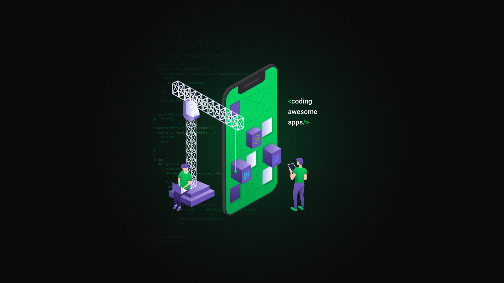

<h1 align="center">
    
</h1>

<h3 align="center">
  OmniStack 10: API NodeJS
</h3>

<p align="center">“Não espere para plantar, apenas tenha paciência para colher”!</blockquote>

<p align="center">
  

  <a href="https://rocketseat.com.br">
    
  </a>

  

  

  <a href="https://github.com/IgorClemente/omnistack-week-challenge1/stargazers">
    
  </a>

  
</p>

<p align="center">
  <a href="#rocket-descrição">Descrição</a>&nbsp;&nbsp;&nbsp;|&nbsp;&nbsp;&nbsp;
  <a href="#hammer-iniciando-a-aplicação">Iniciando aplicação</a>&nbsp;&nbsp;&nbsp;|&nbsp;&nbsp;&nbsp;
  <a href="#memo-licença">Licença</a>
</p>

## :rocket: Descrição

A semana Omnistack 10 é um workshop direto ao ponto usando a stack Javascript: [NodeJS](https://nodejs.org/en/), [ReactJS](https://pt-br.reactjs.org), [React Native](https://reactnative.dev/?source=post_page-----6e8a2396eea1----------------------). Durante essa semana é desenvolvido uma aplicação chamada: DevHunter, através da interface WEB, é possível cadastrar um desenvolvedor e o mesmo aparece no dispositivo mobile em tempo real, informando sua localização e lista de tecnologias. Através da aplicação Mobile é possível buscar através do mapa ou filtrar a busca por tecnologias.

Esse repositório tem o código fonte do Backend da aplicação DevHunter.

:heavy_minus_sign: [Aplicação Web - ReactJS](https://github.com/IgorClemente/omnistack-week-challenge2)
:heavy_minus_sign: [Aplicação Mobile - React Native](https://github.com/IgorClemente/omnistack-week-challenge3)

## :computer: Tecnologias e Ferramentas

- [NodeJS](https://nodejs.org/en/)
- [ReactJS](https://pt-br.reactjs.org)
- [React Native](https://reactnative.dev/?source=post_page-----6e8a2396eea1----------------------)
- [Mongo DB](https://www.mongodb.com)
- [Socket.io](https://socket.io)
- [Expo](https://expo.io)

### Rotas

- `GET /devs`: Rota responsável por retornar todos os `devs`, o retorno é um array de `[devs]`:

- `POST /devs`: Rota responsável por criar `dev` dentro da plataforma. Você deve fornecer os seguintes parâmetros: `github_username` : Nome de usuário do Github, `techs` : Lista de tecnologias, separado por `,`, `latitude` e `longitude` : Coordenadas do local onde o dev se encontra:

```js

{
	"github_username" : "dev1903",
	"techs": "NodeJS, React, React Native",
	"latitude": "-23.6181725",
	"longitude": "-46.6766297"
}

```

- `GET /search`: Rota responsável por realizar busca dentro da plataforma através de um filtro. É necessário fornecer: `techs` : Tecnologias separadas por vírgula, `latitude` e `longitude` : Localização atual do usuário que está fazendoa a busca. Obs: Todos os parâmetros devem ser enviados por `query string`.

## :hammer: Iniciando aplicação

Para iniciar a aplicação, primeiro instale todas as dependências:

```bash

  yarn

```

Agora inicie a aplicação:

```bash

  yarn dev

```

## :memo: Licença

Esse projeto está sob a licença MIT. Veja o arquivo [LICENSE](LICENSE) para mais detalhes.

---

Projeto desenvolvido by Igor Clemente :wave:
